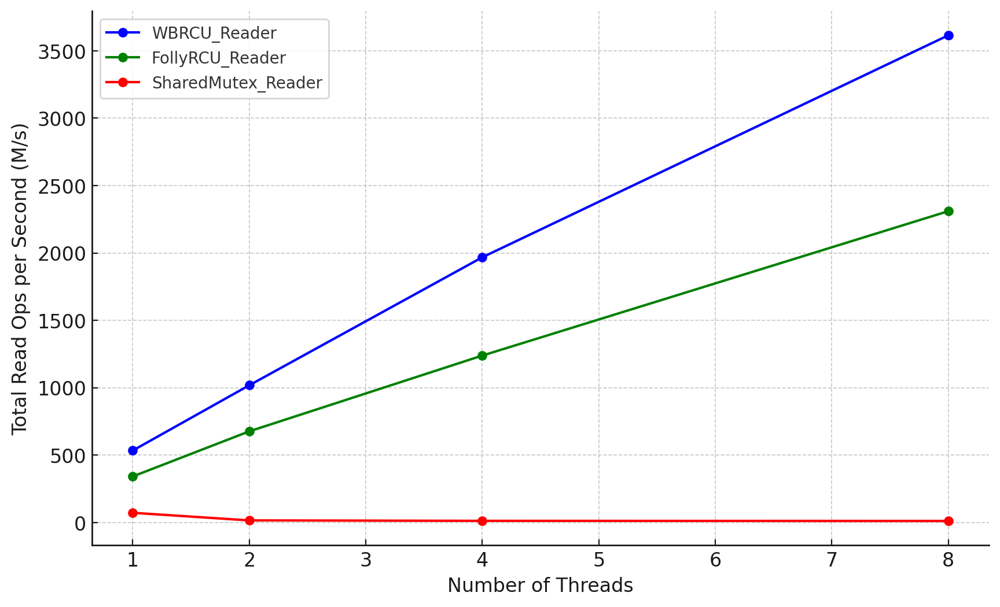
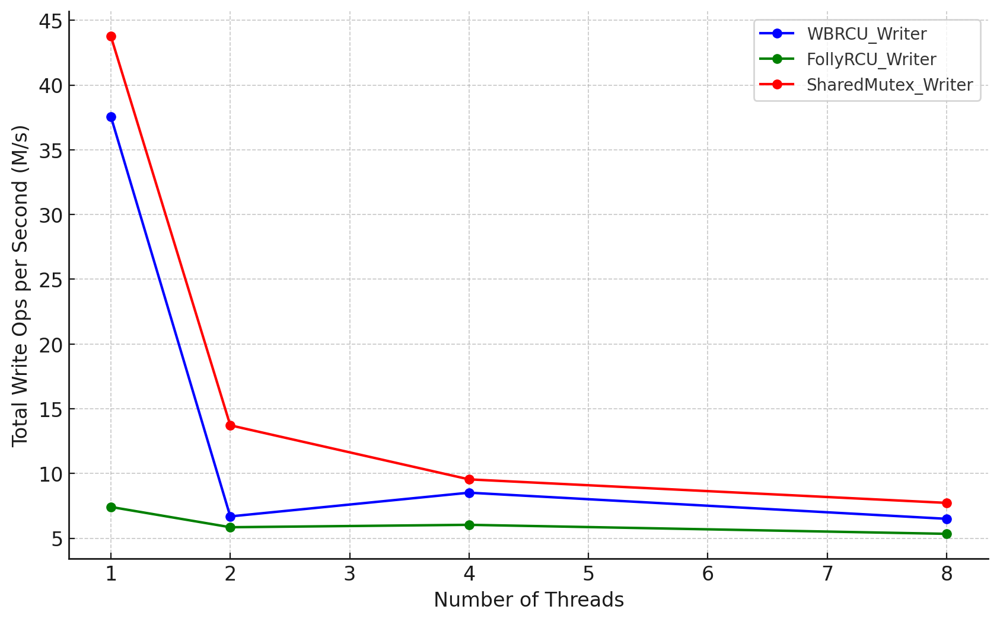

# Checkpoint 1 Report

- Jiawei He, jiaweihe@umich.edu
- Jirong Yang, yjrcs@umich.edu
- Fangyi Dai, fdai@umich.edu
- Ziang Wang, ziangw@umich.edu
- github repo link: https://github.com/waker-he/writeboost-rcu

## Adjustment of Goals

In the submitted project proposal for our enhanced RCU library, WriteBoost RCU, the focus was on enhancing the update-side performance. However, upon further consideration, we've refined our primary goal to address a more fundamental issue in existing RCU (Read-Copy-Update) libraries: existing RCU libraries do not provide an RCU-centric update synchronization mechanism. 

Consider this example of a typical update operation using an existing RCU library:

```cpp
extern std::atomic<Data*> ptr;
extern std::mutex mut;

void update() {
    mut.lock();
    // updaters synchronize through mutex, so we only need relaxed ordering here
    auto newPtr = new Data{*ptr.load(std::memory_order_relaxed)};
    doSomeUpdate(newPtr);
    // release store so that the update is visible to readers
    auto oldPtr = ptr.exchange(newPtr, std::memory_order_release);
    mut.unlock();
    // Existing RCU library only provides deferred reclamation service for updaters
    rcu_retire(oldPtr);
}
```

This code exposes many complexities to RCU users:

1. Handling atomic pointers manually
2. Ensuring correct memory fence synchronization
3. Managing memory allocations and copy operations
4. Implementing additional synchronization mechanisms (like mutexes) to ensure consistency and prevent updates from overriding each other

These exposed complexities positioning RCU as an expert synchronization facility and making it complicated to improve update-side performance. WriteBoost RCU aims to address these problems by providing a user-friendly update synchronization interface, encapsulating the complexities of memory fence handling, memory allocations and copy operations, synchronization between update operations and reclamation of old objects. By taking responsibility for update synchronization and memory reclamation within the library, WriteBoost RCU aims at achieving:

1. __Ease of Use__: By simplifying the API, WriteBoost RCU becomes accessible to a broader range of developers, not just concurrent programming experts.
2. __Update-side Performance Optimization__: By handling update synchronization within the library, WriteBoost RCU can implement an RCU-centric updating synchronization mechanism for optimizing update performance.
3. __Wider Applicability__: The simplified interface and update-side performance improvements can make RCU library a practical alternative in a broader range of use cases.

## Current Built Solution: Interface

The main interface of WriteBoost RCU is a class template `rcu_protected<T>`, where the template parameter `T` is the type of the object to protect. It is initialized by passing a pointer to the object to protect. Here's an example of using WriteBoost RCU:

```cpp
rcu_protected<int> rp{new int(0)};

void reader() {
    auto ptr = rp.get_ptr();
    doSomething(*ptr);
}

void writer() {
    rp.update([](int* ptr) { doSomeUpdate(ptr); });
}
```

Key components of the interface:

1. `get_ptr()`:
   - Used by readers
   - Internally calls `rcu_read_lock` to increment a thread-local read counter
   - Returns a `std::unique_ptr<T const*>` with a custom deleter
   - The custom deleter calls `rcu_read_unlock` instead of deleting the managed pointer

2. `update(callback)`:
   - Used by writers
   - Takes an update callback to perform
   - Ensures that the update callback is executed atomically with respect to other update callbacks passed in

Benefits of this interface:

1. __Simplicity__: 
   - Both readers and writers only need to call one function from the RCU library to perform their operations
   - The updater code becomes much simpler compared to traditional RCU implementations

2. __Robustness__: 
   - Eliminates possibilities of data races and problematic race conditions by using this interface
   - Readers only have access when they are holding the pointer returned from `get_ptr`. The returned pointer is a pointer to `const`, preventing any modifications by readers. When `rcu_read_unlock` is called (via the custom deleter), it signifies that the pointer is out of scope and the reader no longer has access
   - Updates can only be performed through the `update` function, which handles update synchronization properly

## Current Built Solution: Implementation Highlights

### 1. Epoch-based Reclamation

- Basic idea:
    - Keeps track of the current epoch using an atomic integer.
    - Each reader, when calling `get_ptr`, increments a thread-local counter for the current epoch.
    - The reclaimer checks all thread-local counters to ensure an epoch is clear.
- WriteBoost RCU implementation uses a sliding window of two epochs:
    - Instead of an atomic integer, it uses an atomic bool value to represent the current epoch, and the previous epoch is simply `!current_epoch`.
    - An epoch can correspond to multiple versions of the protected object, a reader accessing any version of the object from an epoch prevents all versions of objects within that epoch from being reclaimed.
    - Each of the two epochs has a list of retired objects waiting to be reclaimed.
    - When the reclaimer tries to increment the current epoch, it will ensure that all readers accessing objects from the previous epoch have finished, which allows the reclaimer to clean up the list of retired objects corresponding to the previous epoch and reuse the list for the next epoch. If there are still readers accessing objects from the previous epoch, the object to be retired is appended to the list of retired objects for the current epoch.

### 2. Approximating Amortized Constant Time Complexity for Reclamation

- Retiring an object signifies that a new version of the object has been published. If the reclaimer were to check if it can increment the current epoch every time it retires an object, the time complexity for reclamation (call to `retire`) would be at least O(P), where P is the number of reader threads.
- To address this, the implementation only tries to increment the current epoch only when the size of the list of retired objects for the current epoch exceeds P. In ideal cases, for every P objects reclaimed, there is only one scan of all the thread-local counters (time complexity O(P)), achieving amortized time complexity of O(1) for the reclamation of each object.

### 3. Single Updater

- Only one updater can be in work at a time. Each thread calling `update` tries to register itself as the updater. If registration fails, the thread enqueues its update callback. If registration succeeds, the thread will get a copy of the current object and performs its update and any update callbacks enqueued from other threads.
- After performing the updates, the updater also acts as the reclaimer and is responsible for reclaiming the object.
- This approach ensures that there is only one reclaimer at a time, eliminating the need for extra synchronization for the retire lists, and it can provide better performance for reclamation compared to existing RCU libraries, which need to ensure correct synchronization to avoid race conditions when multiple updaters call `rcu_retire`

### 4. Batch Updates

- A common issue for users of other RCU libraries is the need to create a new copy for every update to avoid blocking readers. This frequent memory allocation and copy operation can incur a performance overhead, leading to a perception that the update-side has poor performance for clients of RCU.
- WriteBoost RCU addresses this by performing batch updates on a single copy. If there are any update callbacks enqueued, the updater will perform these updates on the same copy. This approach is able to amortize the overhead across multiple updates, improving overall performance.

### 5. Object Pool

- To increase memory utilization and further reduce the overhead of updates, WriteBoost RCU makes use of an object pool, which is a list of objects that are ready to be reclaimed (no readers are accessing them anymore).
- When performing updates, the implementation can reuse memory from the object pool and reduces the overhead of updates to a copy assignment operation, further optimizing performance.


## Initial Results

We conducted some basic benchmarking to compare the performance of WriteBoost RCU (WBRCU) against Folly RCU and a standard shared mutex implementation. The benchmarks were run on an 8-core 2400 MHz CPU. In the benchmarks, the shared data is just a 64-bit integer. Here are our initial findings:

### Reader Performance

<p align="center">
    
</p>

- WBRCU demonstrated excellent scalability for read operations. As the number of threads increased from 1 to 8, the total read operations per second (ops/s) increased nearly linearly, reaching about 3.61 billion ops/s with 8 threads.
- Folly RCU also showed good scalability but with lower overall performance, reaching about 2.31 billion ops/s with 8 threads.
- The shared mutex implementation exhibited poor scalability, with performance degrading as the number of threads increased.

### Writer Performance

<p align="center">
    
</p>

- All implementations showed decreased write performance as the number of threads increased, which is expected due to increased contention.
- WBRCU provides better write performance than Folly RCU across all thread counts.
- However, both RCU implementations show lower write performance compared to SharedMutex. This is due to the inherent copy and memory allocation overhead in RCU operations, which are necessary to maintain the read-side performance benefits.

## Next Steps

1. **Exploring Multiple Updaters**: Our current implementation only allows a single updater at a time, which is a limitation due to the nature of concurrent updates where each update depends on the state of shared data. In such cases, updates must be serialized, making writer scalability difficult. However, if two updates are independent and target different regions of the shared data, we could leverage Hardware Transactional Memory (HTM) to perform these updates in parallel. By controlling the number of updater threads within our RCU library, we can enable parallel updates while managing HTM abort rates to maintain performance.
2. **Thread-Local Counter Optimization**: Currently, each reader increments a thread-local counter implemented using `folly::ThreadLocal`, which is optimized for non-trivial types. However, since our counter is a simple 8-bit integer, we may achieve better performance by developing a custom `ThreadLocal` implementation tailored to this lightweight usage.
3. **Optimizing the Update Queue**: We are using `folly::MPMCQueue` (a bounded concurrent queue) for managing update callbacks. However, if the queue is full, enqueue operations in `rcu_protected<T>::update` block, potentially slowing performance. We plan to investigate unbounded queue alternatives to avoid blocking behavior and further optimize performance.
4. **Comprehensive Performance Evaluation**: Our initial benchmarking provides only a basic performance overview. A more thorough evaluation is needed, including:
   - Testing on machines with more cores (preferably 64 or more).
   - Varying key parameters such as the number of threads, read-write ratios, and the size of protected data.
   - Implementing concurrent data structures using our RCU library and comparing their performance in different scenarios.
