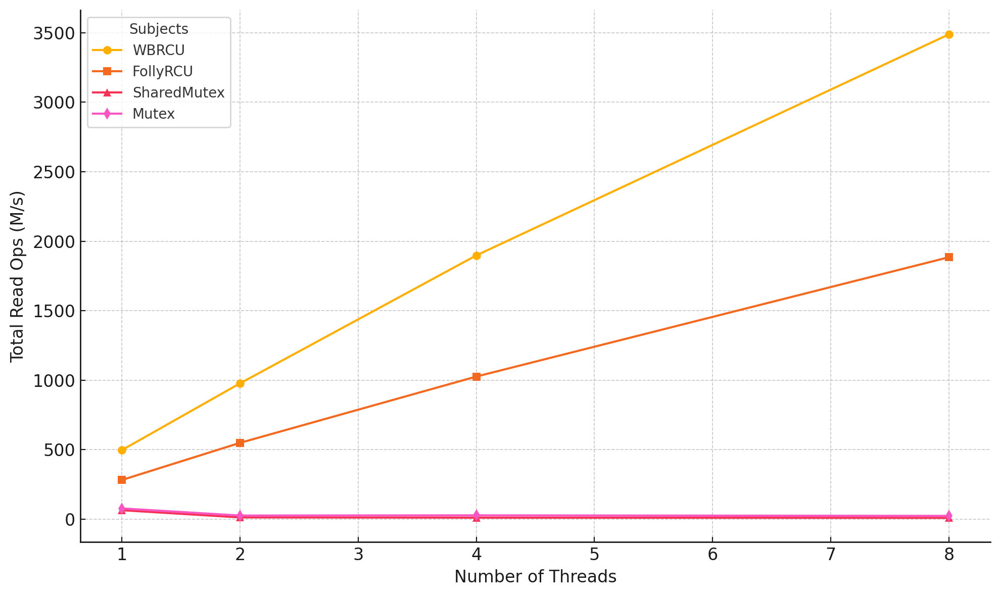
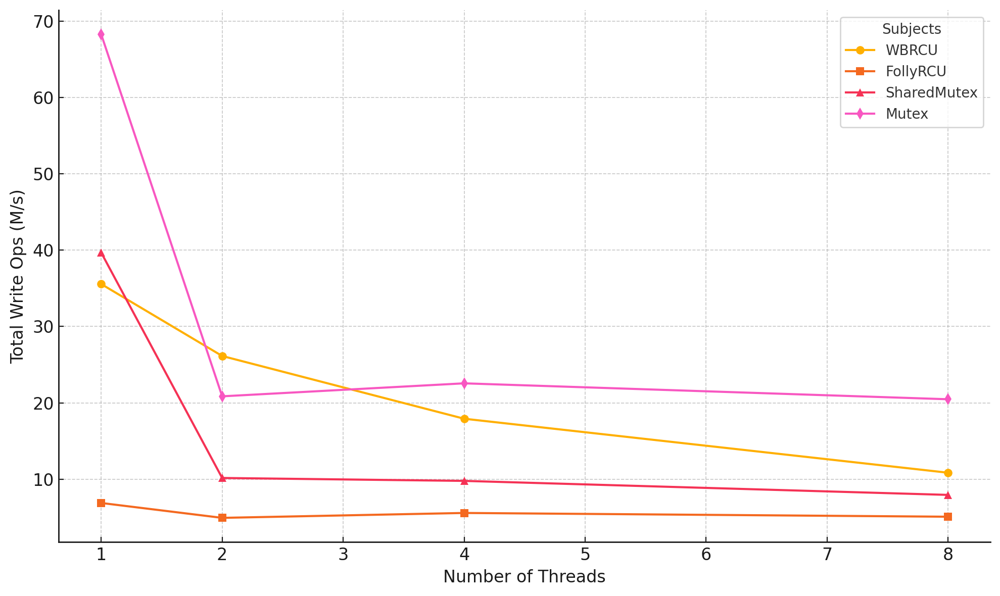
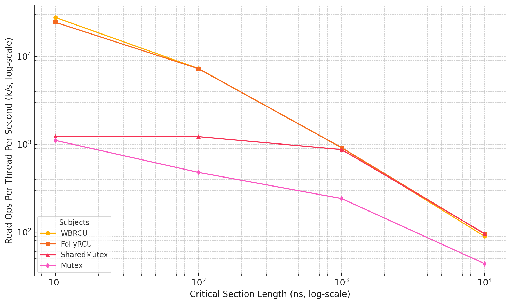
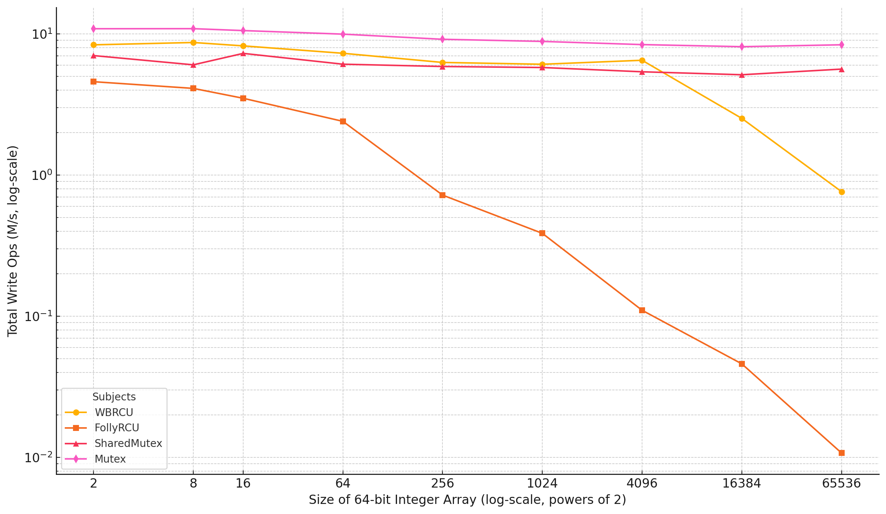
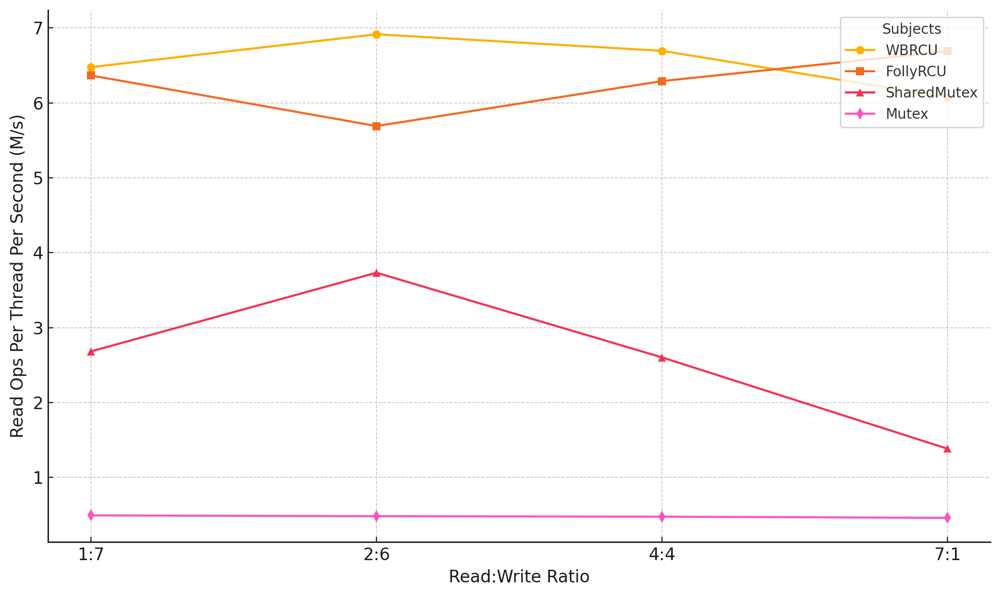
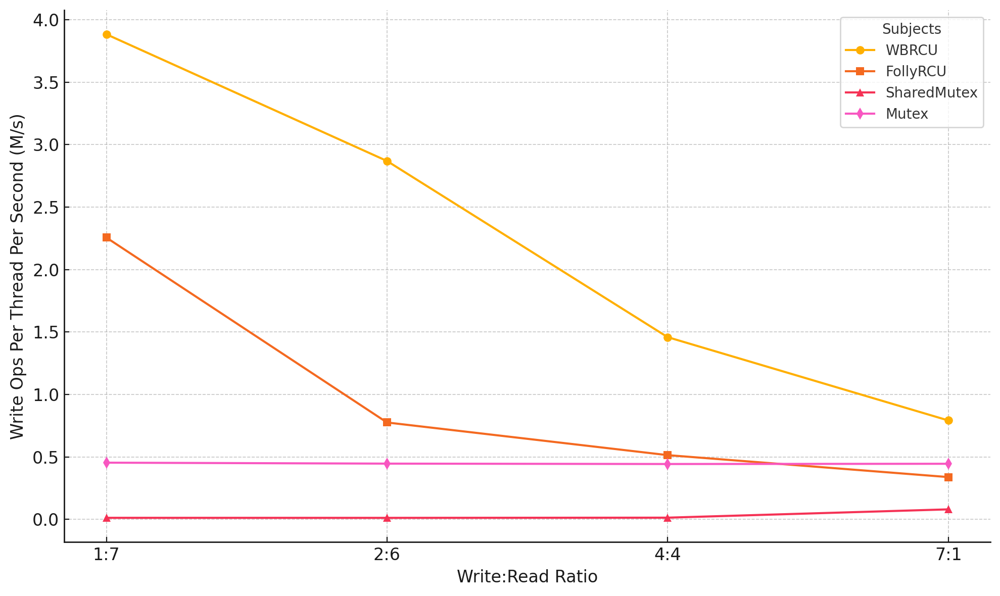

# Checkpoint 2 Report

 github repo link: https://github.com/waker-he/writeboost-rcu
- Jiawei He, jiaweihe@umich.edu
- Jirong Yang, yjrcs@umich.edu
- Fangyi Dai, fdai@umich.edu
- Ziang Wang, ziangw@umich.edu

## Interface

The main interface of WriteBoost RCU is a class template `rcu_protected<T>`, where the template parameter `T` is the type of the object to protect. It is initialized by passing a pointer to the object to protect. Here's an example of using WriteBoost RCU:

```cpp
rcu_protected<int> rp{new int(0)};

void reader() {
    auto ptr = rp.get_ptr();
    doSomething(*ptr);
}

void writer() {
    rp.update([](int* ptr) { doSomeUpdate(ptr); });
}
```

Key components of the interface:

1. `get_ptr()`:
   - Used by readers
   - Internally calls `rcu_read_lock` to increment a thread-local read counter
   - Returns a `std::unique_ptr<T const*>` with a custom deleter
   - The custom deleter calls `rcu_read_unlock` instead of deleting the managed pointer

2. `update(callback)`:
   - Used by writers
   - Takes an update callback to perform
   - Ensures that the update callback is executed atomically with respect to other update callbacks passed in

Benefits of this interface:

1. __Simplicity__: 
   - Both readers and writers only need to call one function from the RCU library to perform their operations
   - The updater code becomes much simpler compared to traditional RCU implementations

2. __Robustness__: 
   - Eliminates possibilities of data races and problematic race conditions by using this interface
   - Readers only have access when they are holding the pointer returned from `get_ptr`. The returned pointer is a pointer to `const`, preventing any modifications by readers. When `rcu_read_unlock` is called (via the custom deleter), it signifies that the pointer is out of scope and the reader no longer has access
   - Updates can only be performed through the `update` function, which handles update synchronization properly

## Implementation Highlights

### 1. Epoch-based Reclamation

- Basic idea:
    - Keeps track of the current epoch using an atomic integer.
    - Each reader, when calling `get_ptr`, increments a thread-local counter for the current epoch.
    - The reclaimer checks all thread-local counters to ensure an epoch is clear.
- WriteBoost RCU implementation uses a sliding window of two epochs:
    - Instead of an atomic integer, it uses an atomic bool value to represent the current epoch, and the previous epoch is simply `!current_epoch`.
    - An epoch can correspond to multiple versions of the protected object, a reader accessing any version of the object from an epoch prevents all versions of objects within that epoch from being reclaimed.
    - Each of the two epochs has a list of retired objects waiting to be reclaimed.
    - When the reclaimer tries to increment the current epoch, it will ensure that all readers accessing objects from the previous epoch have finished, which allows the reclaimer to clean up the list of retired objects corresponding to the previous epoch and reuse the list for the next epoch. If there are still readers accessing objects from the previous epoch, the object to be retired is appended to the list of retired objects for the current epoch.

### 2. Fine-grained Reclamation

- For the implementation of the thread-local counter for the reader, we use `folly::ThreadLocal<Tag>`, which requires specifying a unique `Tag` type so you don't block other ThreadLocal object usage.
- As we need a different `Tag` type for each `rcu_protected<T>` instantiation, we created a helper function `wbrcu::rand()` which generates a compile-time random number based on the source location of the invocation site. By passing this random number to the second template parameter of `rcu_protected`, a unique tag type will be generated and user will be able to get the desired fine-grained reclamation:
    ```cpp
    wbrcu::rcu_protected<int, wbrcu::rand()> rp{new int{0}};
    ```

### 3. Approximating Amortized Constant Time Complexity for Reclamation

- Retiring an object signifies that a new version of the object has been published. If the reclaimer were to check if it can increment the current epoch every time it retires an object, the time complexity for reclamation (call to `retire`) would be at least O(P), where P is the number of reader threads.
- To address this, the implementation only tries to increment the current epoch only when the size of the list of retired objects for the current epoch exceeds P. In ideal cases, for every P objects reclaimed, there is only one scan of all the thread-local counters (time complexity O(P)), achieving amortized time complexity of O(1) for the reclamation of each object.

### 4. Single Updater and Reclaimer

- Only one updater can be in work at a time. Each thread calling `update` tries to register itself as the updater. If registration fails, the thread enqueues its update callback. If registration succeeds, the thread will get a copy of the current object and performs its update and any update callbacks enqueued from other threads.
- After performing the updates, the updater also acts as the reclaimer and is responsible for reclaiming the object.
- This approach ensures that there is only one reclaimer at a time, eliminating the need for extra synchronization for the retire lists, and it can provide better performance for reclamation compared to existing RCU libraries, which need to ensure correct synchronization to avoid race conditions when multiple updaters call `rcu_retire`

### 5. Batch Updates

- A common issue for users of other RCU libraries is the need to create a new copy for every update to avoid blocking readers. This frequent memory allocation and copy operation can incur a performance overhead, leading to a perception that the update-side has poor performance for clients of RCU.
- WriteBoost RCU addresses this by performing batch updates on a single copy. If there are any update callbacks enqueued, the updater will perform these updates on the same copy. This approach is able to amortize the overhead across multiple updates, improving overall performance.

### 6. Flushing Threshold

- With batch updates, the updater can theoretically perform the updates indefinitely on the private copy and never publish the result. To avoid this theoretical infinite latency, WriteBoost RCU allows user to specify the flushing threshold as the third template parameter of `rcu_protected`.
- Flushing threshold is the maximum number of updates that will be performed on the private copy of the updater before publishing to readers, and the default value is 20.

### 7. Object Pool

- To increase memory utilization and further reduce the overhead of updates, WriteBoost RCU makes use of an object pool, which is a list of objects that are ready to be reclaimed (no readers are accessing them anymore).
- When performing updates, the implementation can reuse memory from the object pool and reduces the overhead of updates to a copy assignment operation, further optimizing performance.

## Benchmarking Results

- We conducted comprehensive benchmarking to compare the performance of WriteBoost RCU (WBRCU) against:
    - Folly's RCU
    - `std::shared_mutex` (or read/write lock)
    - `std::mutex`
- The benchmarks were run on an 8-core 2400 MHz CPU.
- There are 4 key parameters to vary for benchmarking: total number of threads, length of critical section, size of the protected data, and read-write ratio. It is impractical to try all possible combinations of the varying values from these 4 parameters. As a result, to see the effects of varying a specific parameter, we will fix the values of the other 3 parameters.

### 1. Total Number of Threads

<p align="center">
    
</p>

What this benchmark is testing:
- Measures read performance when multiple threads concurrently read a protected 64-bit integer
- Tests scalability by increasing reader threads from 1 to 8 on an 8-core CPU
- The benchmark measures total read operations per second, with no additional computation being done during the read

Key analysis points:
1. Superior RCU Scaling:
   - Both RCU implementations show near-linear scaling with thread count, with WBRCU reaching ~3.5G ops/s and Folly RCU reaching ~1.9G ops/s at 8 threads
   - WBRCU consistently outperforms Folly RCU by roughly 2x across all thread counts, likely due to its optimized thread-local counter design and simplified read path

2. Lock-Based Performance Degradation:
   - Both mutex and shared_mutex show severe performance degradation with increased threads
   - shared_mutex performance drops from 65M ops/s (1 thread) to 10M ops/s (8 threads)
   - This demonstrates the classic reader lock contention problem that RCU was designed to solve

3. WBRCU Efficiency:
   - Even with a single thread, WBRCU (496M ops/s) is significantly faster than shared_mutex (65M ops/s) and mutex (78M ops/s)
   - The performance gap widens dramatically with more threads, showing WBRCU has achieved excellent read-side scalability as intended

<p align="center">
    
</p>

What the benchmark is testing:
- Measures write performance when multiple threads concurrently increment a protected 64-bit integer
- Tests write scalability by increasing writer threads from 1 to 8 on an 8-core CPU
- Compares the same four synchronization mechanisms with writers-only workload
- Each operation is a simple increment, isolating the synchronization overhead

Key analysis points:
1. Single-Writer Performance:
   - std::mutex performs best for single-writer (68M ops/s), followed by shared_mutex (39M ops/s)
   - WBRCU shows respectable single-writer performance (35M ops/s) despite its more complex update mechanism
   - Folly RCU lags significantly (6.8M ops/s) in single-writer scenarios

2. Write Scalability Patterns:
   - All implementations show decreasing performance with more writers, which is expected since writes must be serialized
   - WBRCU's performance degrades more gracefully than shared_mutex, maintaining higher throughput up to 4 threads
   - This is likely due to WBRCU's batch update and object pooling optimizations reducing allocation overhead

3. Multi-Writer Efficiency:
   - At 8 threads, std::mutex maintains the best performance (20M ops/s)
   - WBRCU (10.8M ops/s) and shared_mutex (7.9M ops/s) show similar performance levels
   - The relatively good performance of std::mutex suggests that for write-heavy workloads with no readers, simpler synchronization mechanisms may be preferable
   - However, this is a synthetic benchmark - in real applications, there would typically be both readers and writers

### 2. Length of Critical Section

<p align="center">
    
</p>


What the benchmark is testing:
- Measures read performance with varying critical section lengths (10ns to 10000ns)
- Uses 8 concurrent reader threads to evaluate impact of critical section duration
- Critical section length is simulated with busy-waiting
- Compares how different synchronization mechanisms handle increasing read operation durations

Key analysis points:
1. RCU Performance at Short Critical Sections:
   - Both RCU implementations excel with short critical sections (10ns)
   - WBRCU achieves 27.8M ops/thread/s and Folly RCU reaches 24.4M ops/thread/s
   - This is dramatically better than mutex (1.1M ops/thread/s) and shared_mutex (1.2M ops/thread/s)
   - The gap demonstrates RCU's minimal synchronization overhead

2. Convergence at Longer Critical Sections:
   - As critical section length increases to 10000ns, all implementations converge to similar performance (~90k ops/thread/s)
   - This shows that with long critical sections, the actual work dominates over synchronization overhead
   - Exception is std::mutex, which falls to 43k ops/thread/s, showing it still suffers from contention even when dominated by work as access is exclusive

3. Scaling Characteristics:
   - RCU implementations show near-perfect linear scaling with critical section length (visible as straight lines in log-log plot)
   - shared_mutex maintains relatively constant performance until ~1000ns, then drops
   - mutex shows worst scaling, with performance degrading more rapidly as critical section length increases
   - This demonstrates that RCU's performance characteristics are more predictable and scale more naturally with workload

### 3. Size of the Protected Data

<p align="center">
    
</p>

What the benchmark is testing:
- Measures write performance with varying sizes of protected data (array of 2 to 65536 integers)
- Uses 8 concurrent writer threads
- Important measurements for RCU since it needs to copy data for updates
- Results shown as total write operations per second

Key analysis points:
1. Small Data Performance (2-16 integers):
   - All implementations maintain relatively stable performance
   - std::mutex leads (~10.8M ops/s)
   - WBRCU performs well (~8.4M ops/s) despite copy overhead
   - FollyRCU shows early signs of scaling issues, dropping from 4.5M to 3.5M ops/s

2. Copy Overhead Impact:
   - Folly RCU performance degrades dramatically with size (from 4.5M ops/s at 2 integers to 10.7K ops/s at 65536 integers)
   - WBRCU degrades more gracefully, maintaining good performance until 16384 integers (2.5M ops/s) before dropping to 762K ops/s at 65536
   - This difference likely due to WBRCU's object pooling and batch updates reducing allocation/copy overhead

3. Lock-Based Stability:
   - Both mutex and shared_mutex show remarkable stability across all data sizes
   - mutex maintains ~8-10M ops/s throughout
   - shared_mutex stays around 5-7M ops/s
   - This stability is expected since they don't need to copy data for updates
   - However, this advantage would likely disappear with concurrent readers, where RCU excels

The results demonstrate that WBRCU's optimizations (object pooling, batch updates) effectively mitigate the copy overhead issue that typically affects RCU implementations, maintaining competitive performance for moderate-sized data structures.

### 4. Read-Write Ratio

<p align="center">
    
</p>

What the benchmark is testing:
- Measures read performance under concurrent read/write workloads
- Varies read:write ratio by adjusting number of reader vs writer threads (total 8 threads) from 1:7 (1 reader) to 7:1 (7 readers)
- Each operation (both read and write) includes 100ns simulated work
- Shows how read performance is affected by write contention
- Results measured in read operations per thread per second

Key analysis points:
1. RCU Read Stability:
   - Both RCU implementations maintain consistent read performance (~6-7M ops/thread/s) across all ratios
   - WBRCU shows slightly better read performance at lower reader counts (6.5-6.9M ops/thread/s)
   - Folly RCU shows more variation but similar range (5.7-6.7M ops/thread/s)
   - This stability demonstrates RCU's key strength: reads are not significantly impacted by write contention

2. shared_mutex Performance Pattern:
   - Shows interesting non-linear behavior
   - Best performance at 2:6 ratio (~3.7M ops/thread/s)
   - Performance degrades with more readers (down to 1.4M ops/thread/s at 7:1 ratio)
   - This suggests internal contention in shared_mutex's reader-favoring mechanism

3. mutex Limitations:
   - Shows consistently poor read performance (~480K ops/thread/s)
   - Minimal variation across ratios
   - Demonstrates how basic mutex serializes all operations, making it unsuitable for read-heavy workloads

This benchmark clearly shows RCU's advantage in maintaining consistent read performance regardless of write contention, which is crucial for read-heavy workloads.

<p align="center">
    
</p>

What the benchmark is testing:
- Measures write performance under concurrent read/write workloads
- Varies write:read ratio by adjusting number of writer vs reader threads (total 8 threads) from 7:1 (7 writers) to 1:7 (1 writer)
- Each operation (both read and write) includes 100ns simulated work
- Shows how write performance per thread is affected by read contention
- Results measured in write operations per thread per second

Key analysis points:
1. RCU Write Scaling:
   - Both RCU implementations show better write performance with fewer writers as writers are not blocked by readers
   - WBRCU shows superior write throughput:
     * 3.9M ops/thread/s with 1 writer
     * Gracefully degrades to 793K ops/thread/s with 7 writers
   - The scaling pattern suggests effective batch processing of updates when writer count is low

2. Lock-based Performance:
   - std::mutex shows consistent but low performance (~450K ops/thread/s) regardless of ratio
   - shared_mutex performs poorly for writes:
     * Only 13K ops/thread/s with 1 writer
     * Improves slightly to 80K ops/thread/s with 7 writers
     * Shows readers significantly impact write performance

3. RCU Implementation Comparison:
   - WBRCU consistently outperforms Folly RCU across all ratios
   - Demonstrates effectiveness of WBRCU's optimizations (batch updates, object pooling) in reducing write overhead

The results show WBRCU achieves one of its goals of improving write-side performance while maintaining RCU's traditional read-side benefits.

## Adjustments and Next Steps

- We planed to enable multiple updaters for the update operation by making use of Hardware Transactional Memory, but we found that Intel TSX (transactional memory extensions) is already disabled in 2021 due to security reasons for all the Intel CPUs we can find, and also Arm Transactional Memory Extension is a relatively new one and we also could not find an Arm processor that implements it.
- The project is mostly completed, the next steps for us will just be drafting the final report and also adding a detailed README to specify the environment and the scripts to run.

